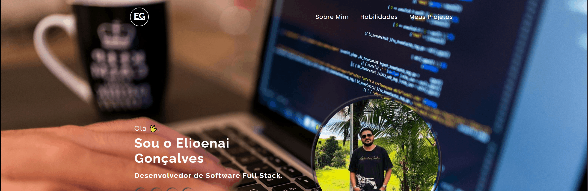

# Portfólio — Elioenai Gonçalves

🔗 [Acesse o portfólio online](https://elioenai-goncalves.github.io/portfolio/#habilidades)

## Sobre o projeto

Este é o meu portfólio pessoal, criado para reunir os projetos que desenvolvi durante meus estudos em programação e apresentar minhas habilidades, experiências e formas de contato.

Sou Elioenai Gonçalves, desenvolvedor com foco em desenvolvimento Full Stack. Busco aprender continuamente, explorar novas tecnologias e transformar conhecimento em projetos práticos.

## Conteúdo do projeto

O portfólio possui as seguintes seções:

- **Home:** apresentação e links para minhas redes sociais.
- **Sobre mim:** informações sobre minha trajetória e objetivos profissionais.
- **Habilidades:** linguagens e tecnologias que estudei e utilizo.
- **Projetos:** links para projetos, exercícios e desafios publicados no GitHub.
- **Rodapé:** links adicionais para redes sociais e contato.

## Objetivo

O objetivo deste projeto é disponibilizar meus trabalhos para amigos, desenvolvedores, professores, recrutadores e empresas.

Além de apresentar minha evolução na programação, o portfólio é um espaço para receber feedbacks, trocar conhecimentos e criar oportunidades profissionais.

## Prévia do projeto



## Tecnologias utilizadas

- HTML5
- CSS3

## Como clonar e executar o projeto

1. Clone o repositório:

```bash
git clone https://github.com/elioenai-goncalves/portfolio.git
```

2. Acesse a pasta do projeto:

```bash
cd portfolio
```

3. Abra o projeto no Visual Studio Code:

```bash
code .
```

4. Abra o arquivo `index.html` no navegador ou utilize a extensão **Live Server** no VS Code.

## Contato

- GitHub: [@elioenai-goncalves](https://github.com/elioenai-goncalves)